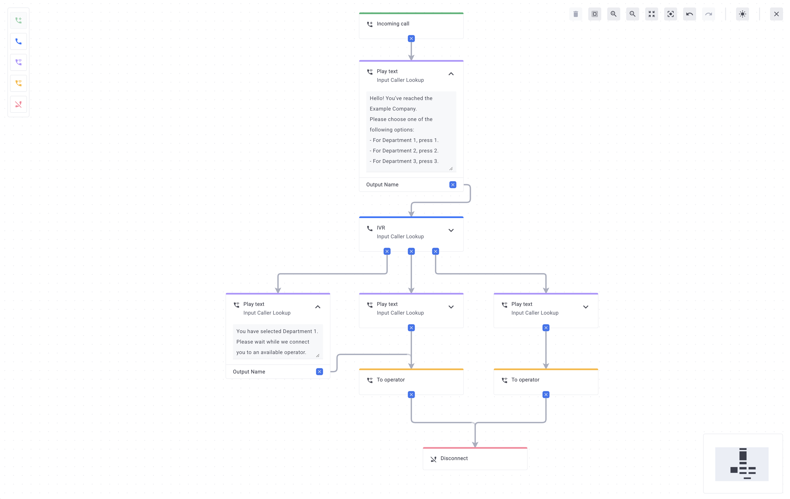

# FCallCenterFlow

This is an example of using the [@foblex/flow](https://foblex.com/flow/home) library in an Angular project.

[DEMO](https://foblex.github.io/f-flow-example)

## Development server

Run `ng serve` for a dev server. Navigate to `http://localhost:4200/`. The application will automatically reload if you change any of the source files.

## License

This example is distributed under the MIT License. See the LICENSE file for more information.

